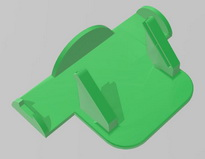

## Micro:Steamakers Stand

A holder helps to keep the Micro:Steamakers in an ergonomic position, prevents shortcircuits and take care the components.  

     

Micro:Steamakers desenvolupada per [Innovadidàctic](https://shop.innovadidactic.com/ca/standard-placas-shields-y-kits/1677-placa-esp32-micro-steamakers-8436574314663.html)  

Tutorial d'en [Federico Coca](https://fgcoca.github.io/ESP32-micro-STEAMakers/). del Club Robótico de Granada 

Suports d'en [Jordi Mayné](https://github.com/maynej) des de Mechatronic Study jordi.mayne@mechatronicstudy.com 

La [documentació](https://github.com/maynej/Micro-Steamakers-Stand/tree/main/Doc/) en PDF   

# Arxius per imprimir Suports per Micro:Steamakers
  
Descripció         | Imatge          | Arxiu STL    
------------- | ------------- | ------------- 
Micro:Steamakers | | [MicroSteamakers](STL/StandMicroSteamaker.stl)
Micro:Steamakers amb batería  | | [Amb bateria](STL/StandMicroSteamakerBat.stl)

# Arxius per imprimir Suports Shield per Micro:Steamakers

   

Descripció         | Imatge          | Arxiu STL    
------------- | ------------- | ------------- 
Micro:Steamakers + Shield  | | [Suport Shield](STL/Shield.stl)
Micro:Steamakers + Shield Stemfie  | | [Suport Stemfie](STL/ShieldStemfie.stl)
 
## Llicència
Creative Commons Attribution-NoComercial-ShareAlike 4.0 International (CC BY-NC-SA 4.0)  

## QR

